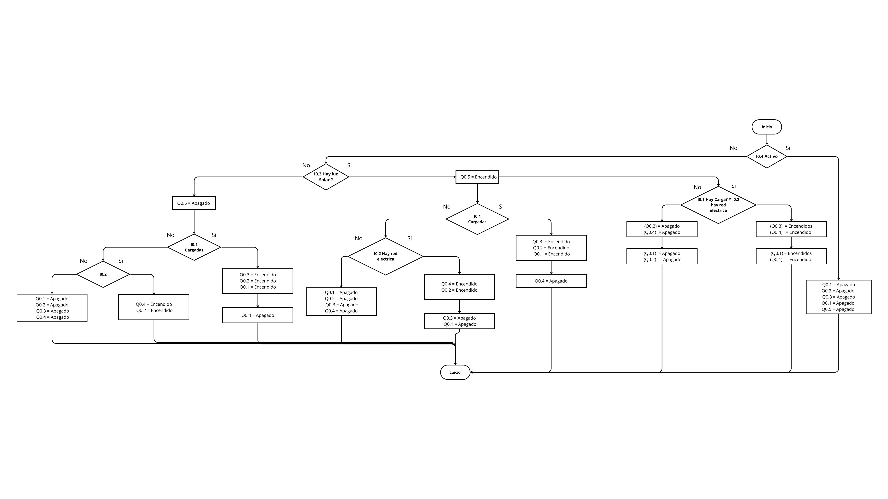

<h1>Mi primer diseño</h1> 
<h2>0. Problema a analizar</h2>
Para iniciar este laboratorio, se nos planteó una situación problema, la cual consistía en lograr realizar un sistema eléctrico para una finca, que dependiendo de diversos factores, lograra conmutar entre dos entradas de energía, una era la red eléctrica de la casa y la otra, entrada era de un banco de baterías que se recarga con luz solar. 
<h2>1. Proceso del dominio comportamental</h2>
Para iniciar con la solución del problema, el grupo planteó las entradas que controlarían el sistema y las salidas que principalmente serían indicadores de las consecuencias de cada entrada, las cuales se ubican en un tablero de control. Tras pensar por un tiempo se decidió tomar las siguientes entradas y salidas.

    

Para las entradas se supusieron 3 sensores encargados de medir la presencia de luz, la funcionalidad de la red eléctrica y la carga de las baterías, la otra salida se supuso como un botón de paro, con la finalidad de quitar la energía a la casa en caso de mantenimientos. Tras analizar lo que iba a medir cada entrada se realizó un tabla de verdad, con la finalidad de establecer cómo iba a variar cada salida en función de cada entrada y combinaciones de estas.

    

    

    

    

    

    

    

<h2>2. Proceso del dominio estuctrural</h2>

    

<h2>3. Lenguaje Ladder</h2>

    

<h2>4. Proceso del dominio físico</h2>

    

