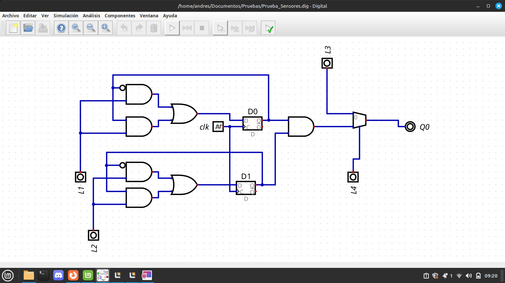
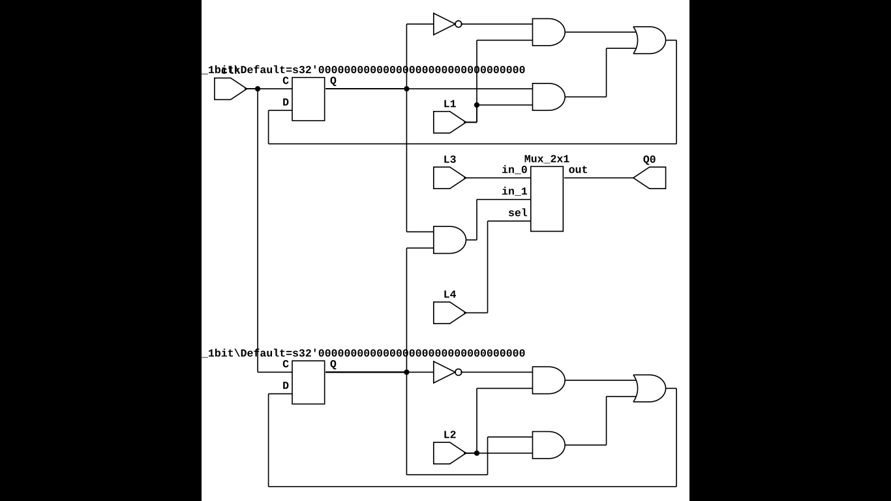

# Laboratorio 4 - Máquina de Estados
En el ámbito de los sistemas digitales, las máquinas de estados representan una herramienta fundamental para el control y la gestión de procesos secuenciales, permitiendo diseñar sistemas complejos con comportamientos predecibles y estructurados. Su aplicación abarca desde sistemas embebidos hasta protocolos de comunicación, destacando por su eficiencia en la transición entre estados definidos bajo condiciones específicas. En este contexto, el presente informe documenta el diseño, implementación y validación de una máquina de estados finitos (FSM, por sus siglas en inglés) desarrollada como parte de un proyecto integrador, cuyo objetivo es controlar un sistema mediante una FPGA (Field-Programmable Gate Array).

La elección de una FPGA como plataforma de implementación se fundamenta en su flexibilidad y capacidad de reconfiguración, características que permiten emular circuitos digitales personalizados sin necesidad de fabricar hardware dedicado. Esto facilita la optimización de recursos lógicos, la paralelización de operaciones y la validación iterativa del diseño. Durante el desarrollo, se empleó la herramientaa de descripción de hardware Verilog, para modelar la máquina de estados, así como software de síntesis y simulación (Quartus) para garantizar su correcto funcionamiento antes de la programación física del dispositivo.

# Dominio Comportamental 


Dentro de la electrónica digital muchas veces existen desafíos de sistemas que necesitan tener en cuenta cuál era su función anteriormente para realizar una nueva acción, es acá donde entran las máquinas de estado, pues gracias a la integración de latch tipo D se logra realizar el guardado de un dato durante un ciclo, el cual dura según el clock implementado, esto ayuda a que la máquina pueda verificar que está realizando paso a paso y decida según sus estados y a veces entradas externas, qué debe realizar. Así dentro del contexto del presente proyecto que trata de automatizar el sistema de luminarias de determinado espacio, se ve necesario la implementación de una máquina de estados que permita establecer el tiempo que se mantedrá la salida activa al momento de que se registre o lea una señal de entrada.

## Circuito de Compuertas lógicas en Digital

<div align="center">
 


</div>

## Estados presentes
  
  <div align="center">
   
  
  
  </div>

## Entradas

El sistema con 4 entradas en total, dos van directamente a la máquina de estados, y los otros dos hacen parte de un multiplexor que permiten que el sistema opere de forma diferente.

## Salidas

El sistema cuenta con una única salida.

# Dominio estructural 

## Descripción en lenguaje HDL (Hardware Description Language) 

El funcionamiento del circuito ha sido implementado directamente en HDL, en la carpeta **Codigo** donde se definen distintos modulos para seguir el principio de separación de entidades, y se reune todo en el *top*.

## Módulo *top.v*
Este módulo integra todas las funciones anteriores.

```verilog
*
 * Generated by Digital. Don't modify this file!
 * Any changes will be lost if this file is regenerated.
 */

module Mux_2x1
(
    input [0:0] sel,
    input in_0,
    input in_1,
    output reg out
);
    always @ (*) begin
        case (sel)
            1'h0: out = in_0;
            1'h1: out = in_1;
            default:
                out = 'h0;
        endcase
    end
endmodule

module DIG_D_FF_1bit
#(
    parameter Default = 0
)
(
   input D,
   input C,
   output Q,
   output \~Q
);
    reg state;

    assign Q = state;
    assign \~Q = ~state;

    always @ (posedge C) begin
        state <= D;
    end

    initial begin
        state = Default;
    end
endmodule


module top (
  input L1,
  input clk,
  input L2,
  input L3,
  input L4,
  output Q0
);
  wire s0;
  wire s1;
  wire s2;
  wire s3;
  wire s4;
  assign s0 = ((~ s1 & L1) | (s1 & L1));
  assign s3 = ((~ s2 & L2) | (s2 & L2));
  Mux_2x1 Mux_2x1_i0 (
    .sel( L4 ),
    .in_0( L3 ),
    .in_1( s4 ),
    .out( Q0 )
  );
  // D0
  DIG_D_FF_1bit #(
    .Default(0)
  )
  DIG_D_FF_1bit_i1 (
    .D( s0 ),
    .C( clk ),
    .Q( s1 )
  );
  // D1
  DIG_D_FF_1bit #(
    .Default(0)
  )
  DIG_D_FF_1bit_i2 (
    .D( s3 ),
    .C( clk ),
    .Q( s2 )
  );
  assign s4 = (s1 & s2);
endmodule
```

## Asignación de Pines
Configuración de la FPGA *Cyclone IV E* en `top.qsf`.

```tcl
set_global_assignment -name FAMILY "Cyclone IV E"
set_global_assignment -name DEVICE EP4CE10E22C8
set_global_assignment -name TOP_LEVEL_ENTITY top
set_global_assignment -name PROJECT_OUTPUT_DIRECTORY build


## ASIGNACIÓN DE PINES ##
set_location_assignment PIN_42 -to L1
set_location_assignment PIN_43 -to L2
set_location_assignment PIN_44 -to L3
set_location_assignment PIN_46 -to L4
set_location_assignment PIN_23 -to clk

#Salidas

set_location_assignment PIN_30 -to Q0

set_global_assignment -name LAST_QUARTUS_VERSION "23.1std.1 Lite Edition"
set_instance_assignment -name IO_STANDARD "3.3-V LVCMOS" -to *
```

## Diagrama RTL 

<div align="center">

 
</div>


# Dominio Fisico 

<div align="center">

 
</div>

## Sensor pir hc-sr501

Es un sensor infrarojo que detecta movimiento, la idea es usarlo para poder automatizar el encendido de luces, y gracias a su modo de funcionamiento con temporizador interno, es posible mantener a salida en 1, durante determinado tiempo. Su rango de alcance de lectura, va de los 3 mts hasta los 7 mts y posee dos modos de operación; un disparo o múltiples disparos. En el caso del proyecto se decide usar la función de múltiples disparos dado que va sumando el tiempo del temporizador cada vez que realiza una lectura, esto aunque una gran solución al problema del proyecto, presenta una limitante y es justamente la suma de los tiempos en lugar de un reset cada vez que registra una lectura, pues si hay mcuahs personas moviéndose, el tiempo de activación podría durar mucho tiempo. Esto es una limitante del sensor que es muy complejo de resolver, pues no posee un clock para que la fpga dirija el temporizador.
## Módulo de fotocelda

Se trata de un sensor que tiene la capacidad de dar un valor alto cuando no es capaz de leer luz, la sensibilidad a la iluminación con la que vuelve a un nivel bajo, se puede ajustar gracias a la presencia de una resistencia en el módulo. Esta entrada es la prioritaria para poder encender las luces, pues se proyecta que sea el que avise al sistema cuando es de noche, junto con el pir son las entradas que van conectadas a la máquina de estados.
## Interruptor 

En este caso el interruptor va a tener la función de actuar como un selector de un multiplexsor, el cual si tiene un valor de 0, permite que el circuito opere con la lógica programada; mientras que si tiene un valor de 1, conecta la salida directamente a una fuente de energía, emulando que las luces están siempre encendidas durante la noche.

# Video
https://youtube.com/shorts/jvM0stkUwHA
