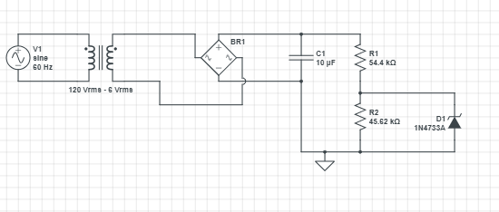
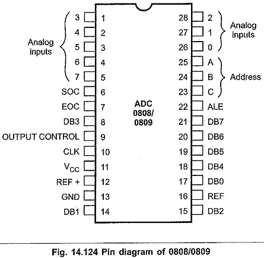
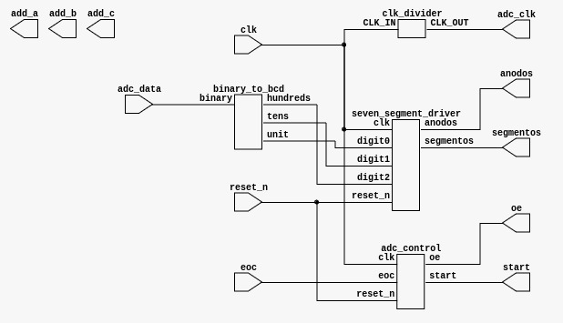

# Laboratorio 3 - Voltimetro 

- Cuesta Segura Dixon Alberto 
- Pinilla Martinez Andrés Gustavo
- Preciado Orobio Yainer Andrés

# Introducción

En esta práctica se diseñará un voltímetro basado en FPGA, empleando un circuito de rectificación y un transformador de 120V a 6V (RMS) para realizar la conversión de tensión. La digitalización de la señal se llevará a cabo mediante el conversor analógico-digital ADC0808, lo que permitirá su procesamiento dentro de la FPGA. Los valores obtenidos se mostrarán en un display de 7 segmentos, facilitando una lectura clara del voltaje.  
El propósito de la práctica es desarrollar un sistema de medición de voltaje que combine diversos componentes electrónicos para la adquisición, procesamiento y visualización de datos. Para ello, se acondicionará la señal de la red eléctrica utilizando un transformador y un circuito rectificador, seguido de su conversión digital con el ADC0808. Luego, la FPGA procesará la información y controlará el display de 7 segmentos para representar el voltaje en tiempo real. 
Mediante esta práctica, se estudiará el comportamiento de cada uno de los componentes utilizados y se explorará la interacción entre hardware y software en sistemas de medición programables, destacando la conversión de señales analógicas a digitales y su visualización.

# Dominio Comportamental 


En Colombia, la tensión RMS suministrada es de 120V, lo que, al convertirla a su valor pico, resulta en aproximadamente 170 Vp. Sin embargo, el ADC requiere una entrada máxima de 5V, considerando que su registro máximo es de 255. Por ello, es necesario establecer una relación de equivalencia que permita ajustar la tensión de entrada al ADC, ya que trabajamos con 170Vp en lugar de 255. Para lograrlo, se implementará un circuito de acoplamiento que recibirá la señal del transformador, la rectificará y reducirá el voltaje mediante un divisor de tensión ajustable con un trimmer. Adicionalmente, para prevenir daños por conexiones incorrectas o cortocircuitos accidentales, se incorporará un diodo Zener de 5.1V, asegurando que la tensión de salida no exceda el límite establecido.

## Circuito de Acople

<div align="center">
 


</div>
## Ajuste de tensión para el ADC

Dado que el ADC tiene una referencia de 5V, este valor correspondería a 255 Vp en su conversión, lo cual no es el objetivo. Para establecer la tensión adecuada, se emplea un divisor de tensión. A través de una regla de 3, se determina que la tensión deseada es 3.33 V para una entrada de 170 Vp. Dado que la tensión disponible después de la rectificación es de 7.3 V, se implementa un divisor de tensión utilizando un trimmer de 100 KΩ. La resistencia R2, donde debe caer la tensión de 3.33 V, se ajusta a 45.6 KΩ dentro del trimmer.


  $$\text{V}_{sal} = V \cdot \cfrac{R2}{R2 + R1}$$

## Conversión analógico-digital (ADC0808)
  
  <div align="center">
   
  
  
  </div>

Para la conversión en el ADC, primero se selecciona la entrada de medición a través del multplexor interno, configurando los selectores de dirección (ADD) a tierra, lo que  habilita la entrada 0. Luego, se establece la referencia de voltaje del ADC en 5 V, coincidiendo con su tensión de alimentación.

Las señales START y EOC se conectan en retroalimentación para sincronizar la toma y procesamiento de datos en el momento adecuado. Las líneas ALE y OE se fijan en 5 V, para garantizar una lectura continua de las entradas analógicas y mantener activas las salidas digitales del ADC. Finalmente, los datos digitalizados se envían a la FPGA, donde serán procesados y desplegados en tres displays de 7 segmentos, mostrando los valores en centenas, decenas y unidades.

## Entradas

La señal de medición proviene directamente del tomacorriente, ingresando como una onda de corriente alterna (CA)

## Salidas

El sistema cuenta con tres salidas: tres displays de 7 segmentos, los cuales mostrarán el valor de la tensión en la red en unidades, decenas y centenas.

# Dominio estructural 

## Descripción en lenguaje HDL (Hardware Description Language) 

El funcionamiento del circuito ha sido implementado directamente en HDL, en la carpeta **Codigo** donde se definen distintos modulos para seguir el principio de separación de entidades, y se reune todo en el *top*.

## Divisor de Frecuencia
Este módulo reduce la frecuencia del reloj de la FPGA, que opera a 50 MHz, a una frecuencia de 1 kHz, adecuada para el ADC0808.

```verilog
module clk_divider #(
    parameter integer FREQ_IN = 50000000,
    parameter integer FREQ_OUT = 1000,
    parameter integer INIT = 0
) (
    input CLK_IN,
    output reg CLK_OUT = 0
);

  localparam integer COUNT = (FREQ_IN / FREQ_OUT) / 2;
  localparam integer SIZE = $clog2(COUNT);
  localparam integer LIMIT = COUNT - 1;

  reg [SIZE-1:0] count = INIT;

  always @(posedge CLK_IN) begin
    if (count == LIMIT) begin
      count   <= 0;
      CLK_OUT <= ~CLK_OUT;
    end else begin
      count <= count + 1;
    end
  end
endmodule
```

## Conversión de Binario a BCD
Este módulo convierte un valor binario en su representación en BCD.

```verilog
module binary_to_bcd (
    input wire [7:0] binary,
    output reg [3:0] hundreds,
    output reg [3:0] tens,
    output reg [3:0] unit
);

always @(*) begin
    hundreds = binary / 100;
    tens = (binary % 100) / 10;
    unit = binary % 10;
end

endmodule
```

## Controlador de Display de 7 Segmentos
Este módulo maneja la multiplexación y activación del display de 7 segmentos.

```verilog
module seven_segment_driver (
    input wire clk,
    input wire reset_n,
    input wire [3:0] digit0,
    input wire [3:0] digit1,
    input wire [3:0] digit2,
    output reg [6:0] segmentos,
    output reg [2:0] anodos
);

reg [1:0] contador;
reg [15:0] prescaler;
reg [3:0] digito_actual;

always @(*) begin
    case (digito_actual)
        4'h0: segmentos = 7'b1000000;
        4'h1: segmentos = 7'b1111001;
        4'h2: segmentos = 7'b0100100;
        4'h3: segmentos = 7'b0110000;
        4'h4: segmentos = 7'b0011001;
        4'h5: segmentos = 7'b0010010;
        4'h6: segmentos = 7'b0000010;
        4'h7: segmentos = 7'b1111000;
        4'h8: segmentos = 7'b0000000;
        4'h9: segmentos = 7'b0010000;
        default: segmentos = 7'b1111111;
    endcase
end

always @(posedge clk or negedge reset_n) begin
    if (!reset_n) begin
        prescaler <= 0;
        contador <= 0;
        anodos <= 3'b111;
    end else begin
        if (prescaler == 16'd50000) begin
            prescaler <= 0;
            case (contador)
                2'b00: begin
                    digito_actual <= digit0;
                    anodos <= 3'b110;
                end
                2'b01: begin
                    digito_actual <= digit1;
                    anodos <= 3'b101;
                end
                2'b10: begin
                    digito_actual <= digit2;
                    anodos <= 3'b011;
                end
            endcase
            contador <= contador + 1;
        end else begin
            prescaler <= prescaler + 1;
        end
    end
end

endmodule
```

## Módulo *top.v*
Este módulo integra todas las funciones anteriores.

```verilog
`include "seven_segment_driver.v"
`include "binary_to_bcd.v"
`include "adc_control.v"
`include "clk_divider.v"

module top (
    input wire clk,
    input wire reset_n,
    input wire [7:0] adc_data,
    input wire eoc,
    output wire adc_clk,
    output wire start,
    output wire oe,
    output wire add_a,
    output wire add_b,
    output wire add_c,
    output wire [6:0] segmentos,
    output wire [2:0] anodos
);

clk_divider clk_div_adc (
    .CLK_IN(clk),
    .CLK_OUT(adc_clk)
);

adc_control adc_ctrl (
    .clk(clk),
    .reset_n(reset_n),
    .eoc(eoc),
    .start(start),
    .oe(oe)
);

wire [3:0] hundreds, tens, unit;
binary_to_bcd bcd_conv (
    .binary(adc_data),
    .hundreds(hundreds),
    .tens(tens),
    .unit(unit)
);

seven_segment_driver display (
    .clk(clk),
    .reset_n(reset_n),
    .digit0(unit),
    .digit1(tens),
    .digit2(hundreds),
    .segmentos(segmentos),
    .anodos(anodos)
);

endmodule
```

## Asignación de Pines
Configuración de la FPGA *Cyclone IV E* en `top.qsf`.

```tcl
set_global_assignment -name FAMILY "Cyclone IV E"
set_global_assignment -name DEVICE EP4CE10E22C8
set_global_assignment -name TOP_LEVEL_ENTITY top
set_global_assignment -name PROJECT_OUTPUT_DIRECTORY build

set_location_assignment PIN_23 -to clk

set_location_assignment PIN_28 -to adc_data[0]
set_location_assignment PIN_30 -to adc_data[1]
set_location_assignment PIN_31 -to adc_data[2]
set_location_assignment PIN_32 -to adc_data[3]
set_location_assignment PIN_33 -to adc_data[4]
set_location_assignment PIN_34 -to adc_data[5]
set_location_assignment PIN_38 -to adc_data[6]
set_location_assignment PIN_39 -to adc_data[7]

set_location_assignment PIN_52 -to adc_clk

set_location_assignment PIN_127 -to segmentos[0]
set_location_assignment PIN_126 -to segmentos[1]
set_location_assignment PIN_125 -to segmentos[2]
set_location_assignment PIN_124 -to segmentos[3]
set_location_assignment PIN_121 -to segmentos[4]
set_location_assignment PIN_120 -to segmentos[5]
set_location_assignment PIN_119 -to segmentos[6]

set_location_assignment PIN_128 -to anodos[0]
set_location_assignment PIN_129 -to anodos[1]
set_location_assignment PIN_132 -to anodos[2]

set_global_assignment -name LAST_QUARTUS_VERSION "23.1std.1 Lite Edition"
```

## Diagrama RTL 

<div align="center">

 
</div>


# Dominio Fisico 

<div align="center">

 
</div>

#Link del video
https://youtu.be/NL6AgS18lOE 
